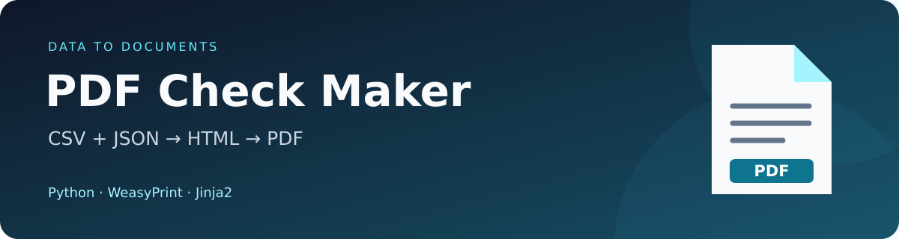

<p align="center">
  
</p>

# 🧾 PDF Check Maker

Генератор PDF-чеков из CSV и JSON с HTML-шаблонами и интерактивным меню в консоли.

<p align="center">
  
  
  
  
  <a href="LICENSE"></a>
</p>

Выберите файл данных, шаблон и `invoice_id` — скрипт объединит позиции чека,
сохранит PDF в `output/` и откроет его в системной программе просмотра.
Примеры данных, шаблон и шрифты с поддержкой кириллицы включены в проект.

## 🧭 Содержание

- [✨ Возможности](#features)
- [📦 Установка](#installation)
- [🚀 Использование](#usage)
- [🗂️ Формат данных и шаблоны](#data-and-templates)
- [🌳 Структура проекта](#project-structure)
- [🛠️ Решение проблем](#troubleshooting)
- [✅ Проверка](#tests)
- [⚖️ Лицензия](#license)

<a id="features"></a>

## ✨ Возможности

- Чтение CSV стандартным модулем `csv` и JSON модулем `json`.
- Нумерованные меню для выбора данных, шаблона и чека.
- Объединение нескольких товарных позиций по `invoice_id`.
- Подстановка данных через Jinja2 и генерация PDF через WeasyPrint.
- Кириллица благодаря встроенному шрифту DejaVu Sans.
- Уникальные имена PDF и автоматическое открытие после сохранения.
- Настраиваемые пути и режим `--no-open` для работы без графического интерфейса.

<a id="installation"></a>

## 📦 Установка

Требуются **Python 3.10+**, системные библиотеки WeasyPrint и зависимости из
`requirements.txt`. Выполняйте команды из папки проекта.

### Linux

Требуется Python 3.10+. Для Ubuntu 22.04+ / Debian 12+:

```sh
sudo apt update
sudo apt install python3 python3-venv python3-pip libpango-1.0-0 libpangoft2-1.0-0 libharfbuzz0b libharfbuzz-subset0 xdg-utils
```

Для Fedora 39+:

```sh
sudo dnf install python3 python3-pip pango xdg-utils
```

Затем в папке проекта:

```sh
python3 -m venv .venv
.venv/bin/python -m pip install -r requirements.txt
.venv/bin/python generate_invoice.py
```

В графической сессии X11 или Wayland PDF открывается через `xdg-open`.
В системе должна быть программа просмотра, назначенная для PDF.
На сервере или через SSH без графического рабочего стола:

```sh
.venv/bin/python generate_invoice.py --no-open
```

Без графической сессии или `xdg-open` скрипт сохраняет PDF и сообщает,
почему автоматическое открытие недоступно.

### Windows (64-bit, PowerShell)

Установите Python и [MSYS2](https://www.msys2.org/).
В терминале **MSYS2 UCRT64** установите Pango:

```sh
pacman -S mingw-w64-ucrt-x86_64-pango
```

Затем в PowerShell, в папке проекта:

```powershell
py -m venv .venv
.venv\Scripts\python.exe -m pip install -r requirements.txt
$env:WEASYPRINT_DLL_DIRECTORIES = "C:\msys64\ucrt64\bin"
.venv\Scripts\python.exe generate_invoice.py
```

Если MSYS2 установлен в другом месте, укажите соответствующую папку `ucrt64\bin`.
Переменную окружения нужно задавать в каждом новом терминале либо сохранить
в настройках окружения Windows.

### macOS

Установите Python 3.10+ и Homebrew, затем в папке проекта:

```sh
brew install pango libffi
python3 -m venv .venv
.venv/bin/python -m pip install -r requirements.txt
export DYLD_FALLBACK_LIBRARY_PATH="$(brew --prefix)/lib:${DYLD_FALLBACK_LIBRARY_PATH:-}"
.venv/bin/python generate_invoice.py
```

Системные зависимости описаны в
[официальной инструкции WeasyPrint](https://doc.courtbouillon.org/weasyprint/latest/first_steps.html).
DejaVu Sans уже включён в `fonts/` вместе с лицензией; устанавливать шрифт в ОС не нужно.

<a id="usage"></a>

## 🚀 Использование

1. Поместите CSV или JSON в `data/`, а HTML-шаблоны — в `templates/`. Можно использовать готовые примеры.
2. Запустите `generate_invoice.py` командой для своей ОС из раздела установки.
3. Введите номер файла данных и номер шаблона.
4. Выберите номер чека из списка `invoice_id`.
5. Найдите готовый PDF в `output/`.

Пример меню для `data/invoices.csv`:

```text
Доступные чеки (invoice_id)
────────────────────────────────────────────────
  1. INV-001 — позиций: 2
  2. INV-002 — позиций: 2
  3. INV-003 — позиций: 1
Номер чека (1–3, 0 — выход):
```

По умолчанию `data/`, `templates/`, `output/` находятся **рядом со скриптом**,
независимо от текущей рабочей директории. При запуске скрипт читает все CSV/JSON
в `data/`, показывает файлы и шаблоны, затем запрашивает их номера и номер
чека из списка `invoice_id`. `0` или Ctrl+C завершает работу.

PDF получает уникальное имя в `output/`, затем открывается системной программой:
`os.startfile` на Windows, `open` на macOS, `xdg-open` на Linux.
Если открытие не удалось, файл остаётся сохранённым.
Ошибочные файлы данных пропускаются с объяснением.

### Параметры командной строки

| Параметр | По умолчанию | Назначение |
| --- | --- | --- |
| `--data-dir` | `data/` рядом со скриптом | Папка с CSV и JSON |
| `--templates-dir` | `templates/` рядом со скриптом | Папка с HTML-шаблонами |
| `--output-dir` | `output/` рядом со скриптом | Папка для готовых PDF |
| `--no-open` | Выключен | Сохранить PDF без автоматического открытия |
| `--help` | — | Показать справку |

Пользовательские относительные пути отсчитываются от директории запуска.
Пример с абсолютными путями на Linux:

```sh
.venv/bin/python generate_invoice.py --data-dir /data --templates-dir /templates --output-dir /output
```

Параметр `--no-open` отключает открытие PDF, например для запуска без рабочего стола.
Сканирование папок не рекурсивное. Используйте собственные доверенные HTML-шаблоны.

<a id="data-and-templates"></a>

## 🗂️ Формат данных и шаблоны

| Поле | Назначение | Пример |
| --- | --- | --- |
| `invoice_id` | Обязательный непустой ID: строка или целое число | `INV-001` |
| `product` | Название товара для стандартного шаблона | `Блокнот` |
| `price` | Цена для стандартного шаблона | `150.00` |
| `qty` | Количество для стандартного шаблона | `2` |

### CSV

Кодировка: UTF-8 (BOM поддерживается). CSV содержит заголовки; поддерживаются
запятая, точка с запятой и табуляция. Каждая запись описывает одну позицию чека:

```csv
invoice_id,product,price,qty
INV-001,Блокнот,150.00,2
INV-001,Ручка,45.50,5
```

`invoice_id` обязателен. Одинаковые ID объединяются; ведущие нули в строковых ID
сохраняются.

### JSON

```json
[
  {"invoice_id": "INV-001", "product": "Блокнот", "price": "150.00", "qty": 2},
  {"invoice_id": "INV-001", "product": "Ручка", "price": "45.50", "qty": 5}
]
```

JSON допускает массив таких объектов, одиночный объект или
`{"invoices": [...]}`. Пример находится в `data/invoices.json`.
Вложенные массивы товарных позиций не поддерживаются: используйте плоские записи.

### HTML-шаблоны

Шаблон получает поля первой записи (`{{ invoice_id }}`, `{{ product }}`,
`{{ price }}`, `{{ qty }}` и другие поля) и список всех позиций `items`:

```html

<p>{{ item.product }} — {{ item.price }} ₽ × {{ item.qty }}</p>

```

`templates/invoice.html` выводит все позиции в одной таблице. Простой шаблон
без `items` подходит для чека с одной позицией; для нескольких позиций скрипт
сообщит об ошибке, чтобы товары не потерялись. Неизвестные плейсхолдеры вызывают
ошибку, данные экранируются. Относительные изображения и CSS разрешаются от папки шаблона.
Цены выводятся как заданы, без вычисления итогов.

Исходные `products.csv` и `template.html` сохранены в корне проекта.
В исходном CSV нет `invoice_id`: для генерации используйте новые примеры из `data/`
или добавьте этот столбец и скопируйте свой CSV в `data/`.

<a id="project-structure"></a>

## 🌳 Структура проекта

```text
pdf-check-maker/
├── docs/
│   └── banner.svg            # Баннер README
├── data/
│   ├── invoices.csv           # Пример чеков в CSV
│   └── invoices.json          # Пример чеков в JSON
├── fonts/
│   ├── DejaVuSans.ttf
│   ├── DejaVuSans-Bold.ttf
│   └── LICENSE.txt            # Лицензия шрифтов
├── output/                   # Сгенерированные PDF
├── templates/
│   └── invoice.html          # Шаблон с несколькими позициями
├── tests/
│   └── test_generate_invoice.py
├── generate_invoice.py
├── requirements.txt
├── LICENSE                  # Лицензия MIT
├── products.csv              # Исходный пример без invoice_id
├── template.html             # Исходный простой шаблон
└── README.md
```

<a id="troubleshooting"></a>

## 🛠️ Решение проблем

| Проблема | Что проверить |
| --- | --- |
| WeasyPrint не загружается | Установлены ли системные библиотеки и пакеты из `requirements.txt` в используемом окружении |
| Windows: не найдена DLL | `WEASYPRINT_DLL_DIRECTORIES` должен указывать на папку `ucrt64\bin` вашей установки MSYS2 |
| macOS: не найдена библиотека | Задайте `DYLD_FALLBACK_LIBRARY_PATH` командой из раздела установки |
| Linux: нет графической сессии | Используйте `--no-open` |
| Linux: не найден `xdg-open` | Установите `xdg-utils` или используйте `--no-open` |
| PDF сохранён, но не открылся | Проверьте системную программу просмотра PDF и откройте файл по выведенному пути |
| Файл данных пропущен | Проверьте UTF-8, структуру записей и наличие непустого `invoice_id` |
| Ошибка плейсхолдера | Сопоставьте поля данных с переменными шаблона; для нескольких товаров используйте `items` |
| Не найден шрифт | Восстановите оба файла `.ttf` в `fonts/` |

<a id="tests"></a>

## ✅ Проверка

Linux / macOS:

```sh
.venv/bin/python -m unittest discover -s tests -v
```

Windows:

```powershell
.venv\Scripts\python.exe -m unittest discover -s tests -v
```

Тесты проверяют чтение и группировку данных, меню и выбор системной команды
открытия PDF. Системные вызовы открытия в тестах имитируются.

<a id="license"></a>

## ⚖️ Лицензия

Код проекта распространяется по лицензии [MIT](LICENSE).
Шрифты DejaVu Sans распространяются по собственной лицензии,
приведённой в [fonts/LICENSE.txt](fonts/LICENSE.txt).
